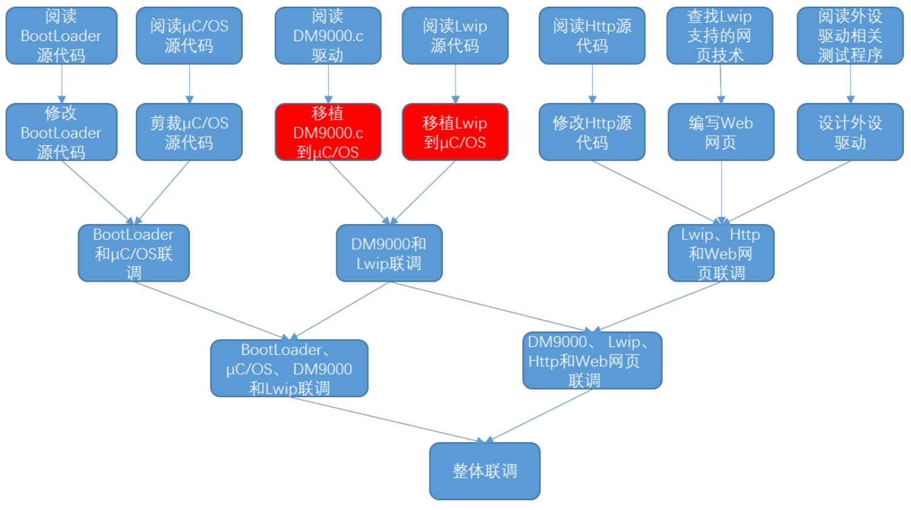

>摘要

<!--more-->

## 关键字

`BootLoader` `TQ2440` `uc/OS-ll` `DM9000`

## 实验内容
> 软件内容:在 ADS1.2 的实验环境中，在 TQ2440“裸板”上，实现一个完 整的嵌入式软件系统，包括 BootLoader 固件、μC/OS 操作系统、DM9000 网卡 驱动、Lwip 网络协议栈、Http 服务器、web 网页、通过 web 显示和控制的外设 驱动等软件模块。 

## 需要的材料

硬件：
- TQ2440单片机板
- J-LINK仿真器
- 串口线
- 网线
- usb串口转接线
软件：
- 操作系统
- ADS1.2集成开发环境
- J-LINK仿真器驱动程序
- 串口终端——超级终端通讯程序或 sscom

## 开发内容

## 具体步骤

- 1.搭建开发环境
- 2.bootloader修改
>* 基本功能：uCOS-II_20120110.rar
>* 扩展功能： EmbedSky_boot_20091031.rar
- 3.μC/OS-II操作系统的裁剪
- 4.DM9000驱动移植
- 5.TCP/IP协议栈Lwip移植
- 6.Http服务器修改
- 8.Web网页编写
> 一块 Stm32 开发板提供的 http server 中 web 网页的示例，支 持通过网页控制开发板的 led 和蜂鸣器等功能.
