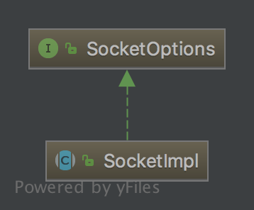

## 简介

“一切皆Socket！”

话虽些许夸张，但是事实也是，现在的网络编程几乎都是用的socket。

网络中的进程是通过socket来通信的，那什么是socket呢？
> socket起源于Unix，而Unix/Linux基本哲学之一就是“一切皆文件”，都可以用“打开open –> 读写write/read –> 关闭close”模式来操作。
我的理解就是Socket就是该模式的一个实现，socket即是一种特殊的文件，一些socket函数就是对其进行的操作（读/写IO、打开、关闭），这些函数我们在后面进行介绍。
---

## 类图



### Socketoptions接口

> 该接口定义了socket编程里的基本方法，该接口被`SocketImpl`和`DataGramSocketImpl`所实现。

声明成员

|修饰符|类型|成员名|作用|
|---|---|---|---|
|@Native public static final|int|TCP_NODELAY|0x0001|
|@Native public static final|int|SO_BINDADDR|0x000F|
|@Native public static final|int|SO_REUSEADDR|0x04|
|@Native public static final|int|SO_REUSEPORT|0x0E|
|@Native public static final|int|SO_BROADCAST|0x0020|
|@Native public static final|int|IP_MULTICAST_IF|0x10|
|@Native public static final|int|IP_MULTICAST_IF2|0x1f|
|@Native public static final|int|IP_MULTICAST_LOOP|0x12|
|@Native public static final|int|IP_TOS|0x3|
|@Native public static final|int|SO_LINGER|0x0080|
|@Native public static final|int|SO_TIMEOUT|0x1006|
|@Native public static final|int|SO_SNDBUF|0x1001|
|@Native public static final|int|SO_RCVBUF|0x1002|
|@Native public static final|int|SO_KEEPALIVE|0x0008|
|@Native public static final|int|SO_OOBINLINE|0x1003|
|private static final|Set<SocketOption<?>>|socketOptions||
|private static final|Set<ServerSocketOption<?>>|ServerSocketOptions||

提供了两个方法来设置和获取这些键值
```java
public void setOption(int optID, Object value) throws SocketException;

public Object getOption(int optID) throws SocketException;
```
---

## 成员变量及方法

|修饰符|类型|变量名|默认值|说明|
|---|---|---|---|---|
|default|Socket|socket|null|实际socket对象|
|default|ServerSocket|serverSocket|null|实际serverSocket对象|
|protected|FileDesceriptor|fd||文件描述器|
|protected|InetAddress|address||远端主机地址|
|protected|int|port||远端主机端口|
|protected|int|localPort||本机地址|

方法

```java
    //根据是否是stream创建Socket或DataGramSocket
    protected abstract void create(boolean stream) throws IOException;
    
    //根据远端主机地址和端口进行连接
    protected abstract void connect(String host, int port) throws IOException;
    
    protected abstract void connect(InetAddress address, int port) throws IOException;
    
    //指定套接字地址和超时时间进行连接远端主机
    protected abstract void connect(SocketAddress address, int timeout) throws IOException;
    
    //监听本地指定地址和端口
    protected abstract void bind(InetAddress host, int port) throws IOException;
    
    //设定最大连接数
    protected abstract void listen(int backlog) throws IOException;
    
    //接受即将到来的连接请求，调用该方法时进入线程阻塞状态
    protected abstract void accept(SocketImpl s) throws IOException;
    
    //获取远端发送的字节流
    protected abstract InputStream getInputStream() throws IOException;
    
    //获取用于向远端发送数据的字节流
    protected abstract OutputStream getOutputStream() throws IOException;
    
    //判断该socket是否可用
    protected abstract int available() throws IOException;
    
    //关闭跟远端建立的连接
    protected abstract void close() throws IOException;
```

```java
    //停掉当前连接，但不断开当前连接，调用该方法后任何发送到该socket的数据都不会被处理。
    protected void shutdownInput() throws IOException {
      throw new IOException("Method not implemented!");
    }

    /**
     * @see java.net.Socket#shutdownOutput()
     * 与上面的方法类似，任何输出输出数据都不会成功，并抛出异常
     */
    protected void shutdownOutput() throws IOException {
      throw new IOException("Method not implemented!");
    }

    protected FileDescriptor getFileDescriptor() {
        return fd;
    }

    protected InetAddress getInetAddress() {
        return address;
    }

    protected int getPort() {
        return port;
    }

    //判断是否支持发送UrgentData,语义暂时不明
    protected boolean supportsUrgentData () {
        return false; // must be overridden in sub-class
    }

    protected abstract void sendUrgentData (int data) throws IOException;

    protected int getLocalPort() {
        return localport;
    }
```
```java
    public String toString() {
        return "Socket[addr=" + getInetAddress() +
            ",port=" + getPort() + ",localport=" + getLocalPort()  + "]";
    }
```

socketOptions和ServerSocketServer初始化时机
```java
    static {
        socketOptions = Set.of(StandardSocketOptions.SO_KEEPALIVE,
                               StandardSocketOptions.SO_SNDBUF,
                               StandardSocketOptions.SO_RCVBUF,
                               StandardSocketOptions.SO_REUSEADDR,
                               StandardSocketOptions.SO_LINGER,
                               StandardSocketOptions.IP_TOS,
                               StandardSocketOptions.TCP_NODELAY);

        serverSocketOptions = Set.of(StandardSocketOptions.SO_RCVBUF,
                                     StandardSocketOptions.SO_REUSEADDR,
                                     StandardSocketOptions.IP_TOS);
    }
    
   protected Set<SocketOption<?>> supportedOptions() {
        if (getSocket() != null) {
            return socketOptions;
        } else {
            return serverSocketOptions;
        }
    }
```
